# GEE Important stuff to know-by-heart

## Balance sheet

Expresses the financial position of a company at a given date.

- `Equity = Assets - Liabilities`;
- `Assets = Equity + Liabilities`;

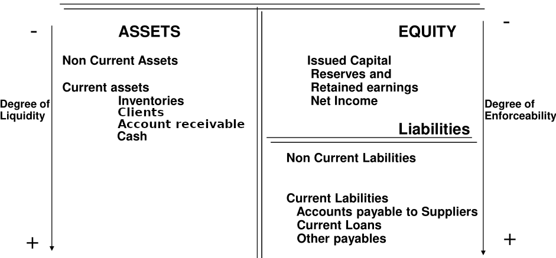

### Assets

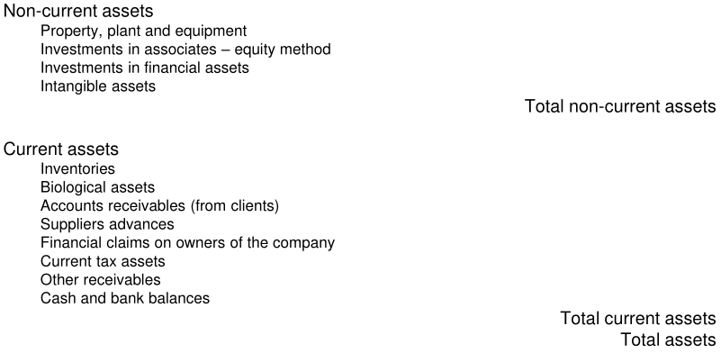

### Equity

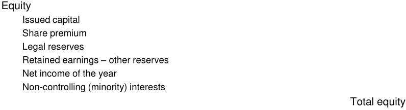

### Liabilities

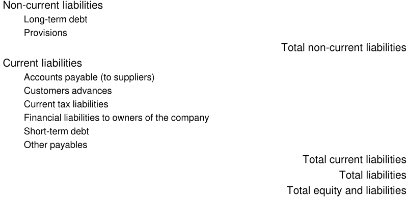

## Income statement by nature

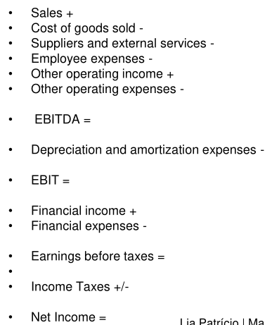

## Ratios

### Analysis of return

- **Return on sales or production**:
  - Net earnings / sales or net income / production
  - **>0 - good; 5 to 10% - excellent**.
- **Return on assets (ROA)**:
  - ROA = net earnings / total assets
  - **>=5% - good; 20% - great**.
- **Return on equity (ROE)**:
  - ROE = net earnings / equity
  - **15 to 20%**.

### Measuring efficiency

- **Asset turnover**:
  - Asset turnover = sales or production / total assets
  - **higher is better**.
- **Avg. inventory period**:
  - (Inventory / cost of goods sold) \* 365
  - **lower is better**.
- **Avg. collection period**:
  - (accounts receivables / sales) \* 365
  - **lower is better**.
- **Avg. payment period**:
  - (accounts payable / purchases) \* 365
  - **it depends**:
    - lower may signal opportunities of reinvestment of capital being lost;
    - higher might show inadequate cash flows.

### Measuring liquidity - short-term

- **Current ratio**:
  - current assets / current liabilities
  - **>= 1** significa que a empresa consegue pagar dinheiro loaned/account
    payable;
  - Se for muito alto, pode indicar que a empresa está a deixar muito dinheiro
    de lado em vez de o investir.
- **Quick (acid-test) ratio**:
  - (cash + marketable securities + receivables) / current liabilities
  - **>= 1** (short term assets dão para cobrir as current liabilities);
- **Cash ratio**:
  - (cash + marketable securities) / current liabilities
  - Similar ao acid;
  - Medida conservadora.
- Working capital = current assets - current liabilities
  - **>1** indica que empresa consegue fund its current operations and
    investments;
  - lower values may indicate risk of distress.

### Measuring liquidity - long-term

- **Equity to assets ratio**:
  - equity / total assets
  - **higher is better**.
  - 75% means company has financed 75% of its assets with shareholder equity;
  - meaning that only 25% is funded by debt;
  - If company liquidated all of its assets to pay off its debt, the
    shareholders would retain 75% of the company's financial resources.
- **Debt to equity**:
  - debt / equity
  - **High => high risk**;
  - Used to gauge to what extent a company is taking on debt as means to
    leverage its assets.
- **Coverage of fixed investments**:
  - (equity + long-term debt) / fixed assets
- **Interest coverage**:
  - EBIT / interest
  - **<= 1.5 - not so good**;
  - Ability to meet interest expenses may be questionable;
  - Used to ensure how well a firm can pay the interest due on outstanding debt.

## Os 7 P's of marketing mix

- **Product** - variety, quality, design, etc...
- **Price** - list price, discounts, credit, etc...
- **Promotion** - sales promotions, advertising, sales force, etc...
- **Place** - channels, coverage, stock availability, etc...
- **Physical evidence** - service environment, sound, sight, etc...
- **Process** - service blueprint, process design, self-service technologies,
  etc...
- **People** - participants, staff, customers to customers, etc...

## Segments

### Levels of segmentation

- **Mass marketing**
- **Segment marketing**
- **Niche marketing**
- **Marketing one-to-one**

### Segmentation variable

- **Geographic segmentation**
- **Socio-demographic segmentation**
- **Psychographic segmentation**
- **Behavioral segmentation**

### Selecting target markets

- **Single-segment concentration** - A empresa concentra-se em servir um segment
  particularmente bem;
- **Selective specialization** - A empresa seleciona um grupo de segments, cada
  um atraente e apropriado;
- **Product/service specialization** - A empresa especializa-se num produto que
  é vendido a diferentes market segments;
- **Market specialization** - A empresa concentra-se em servir muitas
  necessidades de um segment em particular;
- **Full market coverage** - A empresa tenta servir todos os segments em todas
  as suas necessidades.

## Competitive advantage

- Ability of a firm to outperform its rivals;
- Valuable and rate;
- Costly to imitate by competitors;
- Allows earning above-average returns.
- Is the company's ability to get superior performance to its rivals in a
  sustained way.

## SWOT

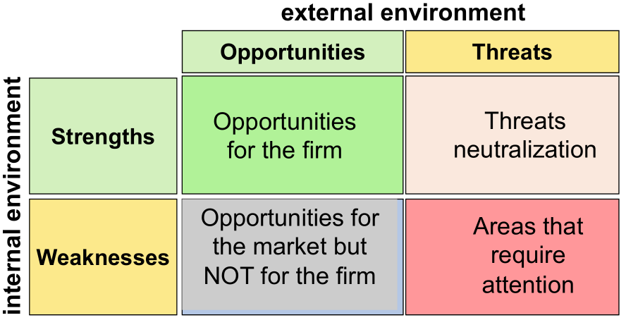

## PESTEL

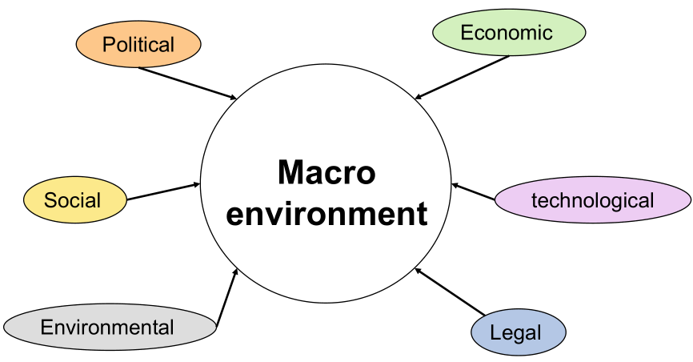

## Porter's Five Forces of competition

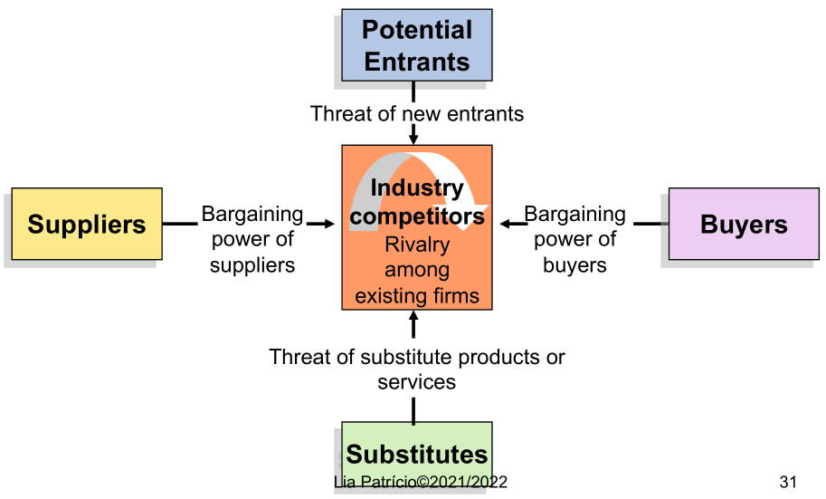

## Startup

### Customer discovery

1. State hypothesis -> draw BMC;
2. Test the problem -> get out of the building and test understanding of
   customer problem/need;
3. Test the solution -> build prototype and test product-market fit;
4. Verify or pivot BMC.

- **Pivot:**
  - Are possible results of hypothesis testing and experimentation (hypothesis
    testing involves failure);
  - Is a substantive change to one or more components of the BMC (iterations are
    minor changes);
  - In a pivot, dismiss hypotheses that do not match reality (but save the
    knowledge built).

### Customer validation

1. Get ready to sell -> acquire customers + prepare distribution channels +
   build MVP;
2. Get out of the building -> "test sell" to early evangelists;
3. Develop positioning -> corporate and product positioning;
4. Verify the BMC -> pivot or proceed (repeatable and scalable?).

## BMC

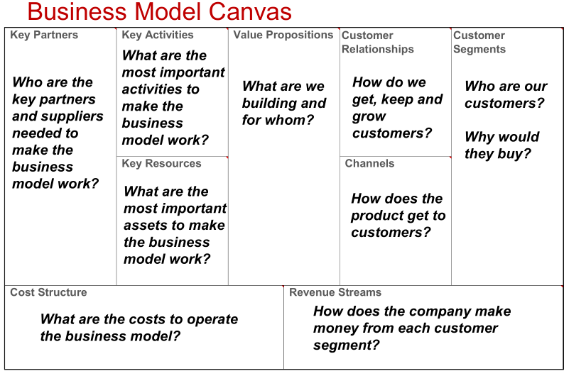

- **Product-Market Fit**:
  - **Value Propositions** + **Customer Segments**.
- **Connecting to customers**:
  - **Customer Relationships** + **Channels** + **Revenue Streams**.
- **Operations**:
  - **Key Partners** + **Key Activities** + **Key Resources** + **Cost
    Structure**.

## Views

### The resource view

- Organization is considered as a set of real assets:
  - tangible + human - "do" the work;
  - intangible - embody "know-how" to do the work.
- This perspective is useful to decide the amounts and types of resources the
  operation needs;

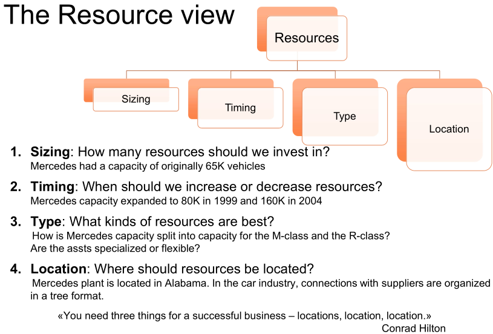

### The process view

- Purpose of resources is to work and generate value;
- Highlights how resources perform activities and add value;
- **Processes:**
  - structure, recurrent activities that transform inputs into outputs;
  - Detailed tasks: billing a customer, implementing and engineering change
    order;
  - Aggregate tasks: new product development, customer service.

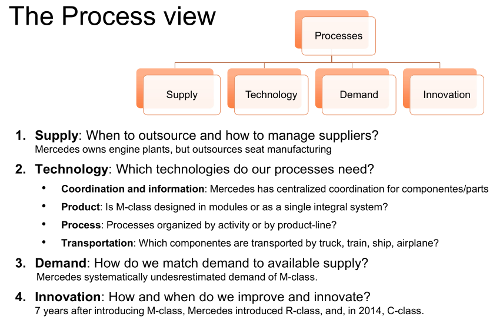

### The competencies view

- A third factor: **values**
  - Standards by which employees set priorities;
  - As organizations become more complex, consistent values are powerful
    mechanisms for employees to make independent but consistent decisions about
    priorities.
- Competencies:
  - What the organization's resources, processes, and values allow to do (its
    abilities);
  - Determine the set of outputs, products, and services that the operation will
    be particularly good at providing;

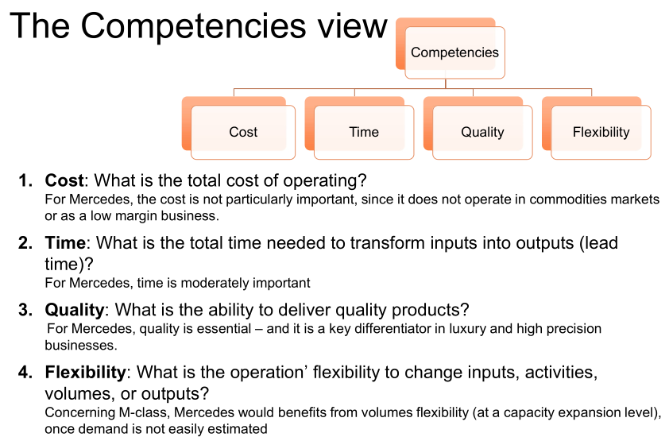
