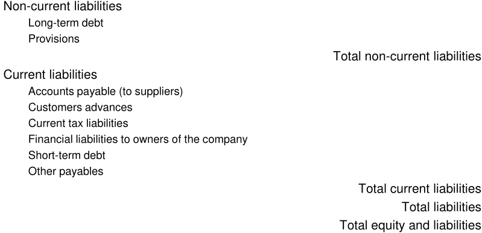
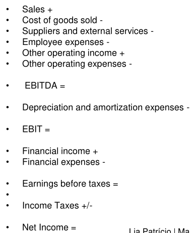
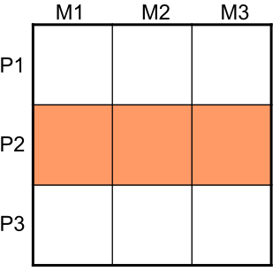
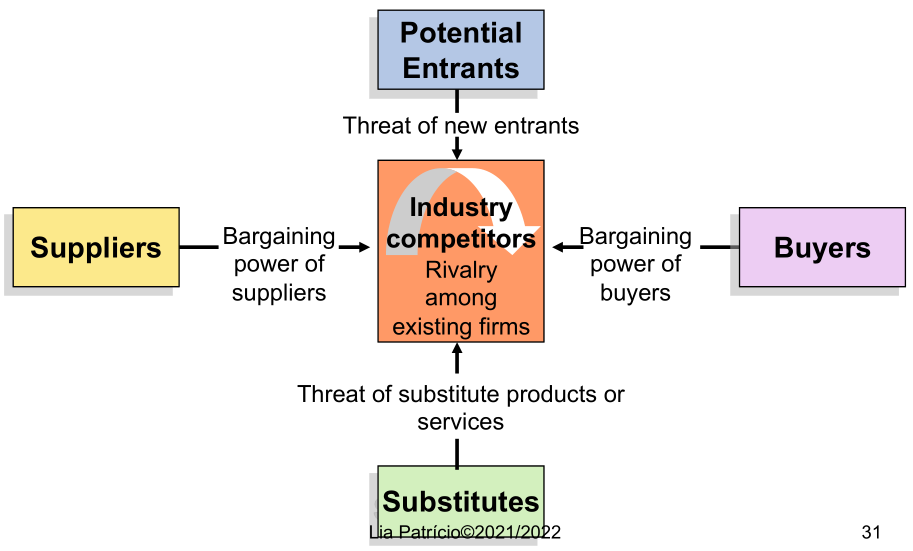
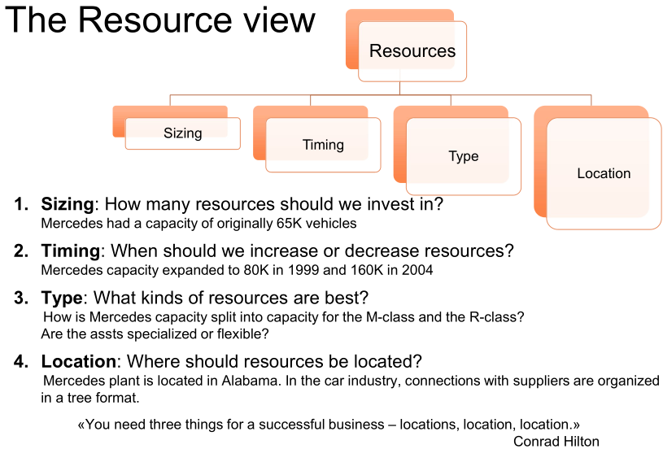
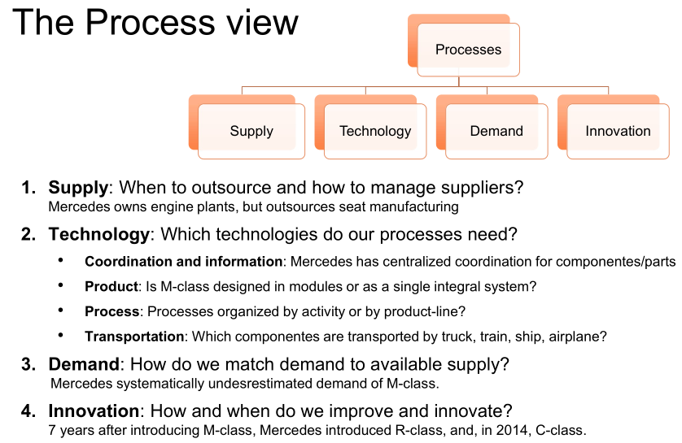
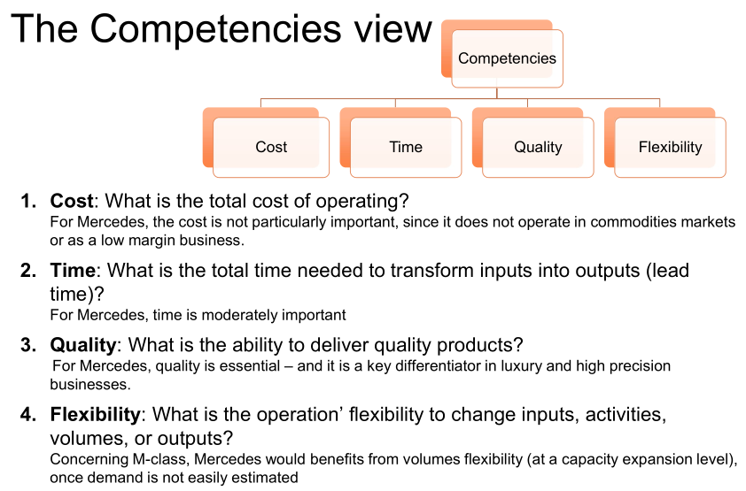

# GEE

## Finoinces

### The role of financial management

- **Monitoring and evaluation**:
  - The company's strategy should lead to positive financial results for the
    shareholders.
- **Support**:
  - Only with a robust financial structure according to the defined strategy can
    the company succeed.

### The objective of financial management

- Maximize firm value;
- Ensure the company has a robust financial structure and cash, so it can pursue
  its global strategy.

### Accounting

- The information system that provides support to financial management;
- Notations that give an account of the financial facts and financial position
  of the company.
- **Relevance** - deve conseguir influenciar decisões;
- **Reliability** - não deve ter erros e/ou bias;
- **Comparability** - deve ser possível comparar financial reports de diferentes
  períodos;
- **Understandability** - devem ser expressos da forma mais clara possível;
- **Materiality** - é material se a omission or misstatement poder influenciar
  decisoes económicas.

### Balance sheet

Expresses the financial position of a company at a given date.

- `Equity = Assets - Liabilities`;
- `Assets = Equity + Liabilities`;

#### Assets

#### Equity

#### Liabilities

### Financial transactions

- **Permutative financial facts**:
  - Changes the composition of the company's patrimony;
  - Doesn't change the value of the patrimony.
- **Modifying financial facts**:
  - Changes the composition of the company's patrimony;
  - Changes the value of the patrimony.

### Income statement

Shows the results (profits or losses) in a certain financial period (**between 2
balance sheets**).

- Assesses the economic performance in the period;
- By **nature** - nature of the expenses and revenues (operating, financial,
  current);
- By **function** - classifies expenses according to their function as part of
  the cost of sales, distribution, or administration.

### Revenues

- **Revenues** - arises in the course of ordinary activities of an enterprise;
- **Gains** - represent other items that meet the definition of income and may,
  or may not, arise in the course of ordinary activities of an enterprise.

Fundamentalmente, não são diferentes porque ambos representam increase in
economic benefits.

### Expenses

Decreases in economic benefits during accounting period.

- **Expenditures** - arise in the course of ordinary activities of the company
  and usually take the form of an outflow or depletion of assets such as cash
  and cash equivalents, inventories, and fixed assets;
- **Losses** - represent other items that meet the definition of expenses and
  may, or may not, arise in the course of the ordinary activities of the
  company.

They are both **expenses**.

### Income statement by nature

### Account

Set of financial items expressed in units of value. Main features:

- **Homogeneity** - must contain only elements that conform to the common
  characteristic that defines it;
- **Completeness** - must include all elements who enjoy the common feature set
  for it.

- **Principle of double entry** -
  $\sum debit\_movements = \sum credit\_movements$

### Financial flows

- **Financial** - operations carried out by the company with external entities.
  Related to the remuneration of factors and good and services sold (expenses
  and revenue);
- **Economic or Productive** - linked to the transformation and incorporation
  into the production process of various materials, labor, etc. until reaching
  the final good/service (costs and yields);
- **Cash Flow** - cash inflows and outflows of the company (receipts and
  payments).

### Depreciation and amortization

### Cash flow statement

Detailed historical information about what were the receipts and payments of a
company during a specific period of time => **demonstrates the company's ability
to generate cash**.

### Financial analysis

- Study of organization's overall financial performance;
- **Objective** - assessment of the economic and financial evolution of the
  company and its ability to generate profits and pay its Liabilities.

1. Understand the macro and industry context;
2. Systematize the information:

- Economic component - capability to generate profits, operational capability of
  the company (income statement);
- Financial component - capability to respond to pay its liabilities (balance
  sheet and cash-flow statement).

3. Structural, evolution and ratio analysis: liquidity, financial stability,
   etc...

### Analysis of return

- **Return on sales or production**:
  - Net earnings / sales or net income / production
  - **>0 - good; 5 to 10% - excellent**.
- **Return on assets (ROA)**:
  - ROA = net earnings / total assets
  - **>=5% - good; 20% - great**.
- **Return on equity (ROE)**:
  - ROE = net earnings / equity
  - **15 to 20%**.

### Measuring efficiency

- **Asset turnover**:
  - Asset turnover = sales or production / total assets
  - **higher is better**.
- **Avg. inventory period**:
  - (Inventory / cost of goods sold) \* 365
  - **lower is better**.
- **Avg. collection period**:
  - (accounts receivables / sales) \* 365
  - **lower is better**.
- **Avg. payment period**:
  - (accounts payable / purchases) \* 365
  - **it depends**:
    - lower may signal opportunities of reinvestment of capital being lost;
    - higher might show inadequate cash flows.

### Measuring liquidity - short-term

- **Current ratio**:
  - current assets / current liabilities
  - **>= 1** significa que a empresa consegue pagar dinheiro loaned/account
    payable;
  - Se for muito alto, pode indicar que a empresa está a deixar muito dinheiro
    de lado em vez de o investir.
- **Quick (acid-test) ratio**:
  - (cash + marketable securities + receivables) / current liabilities
  - **>= 1** (short term assets dão para cobrir as current liabilities);
- **Cash ratio**:
  - (cash + marketable securities) / current liabilities
  - Similar ao acid;
  - Medida conservadora.
- Working capital = current assets - current liabilities
  - **>1** indica que empresa consegue fund its current operations and
    investments;
  - lower values may indicate risk of distress.

### Measuring liquidity - long-term

- **Equity to assets ratio**:
  - equity / total assets
  - **higher is better**.
  - 75% means company has financed 75% of its assets with shareholder equity;
  - meaning that only 25% is funded by debt;
  - If company liquidated all of its assets to pay off its debt, the
    shareholders would retain 75% of the company's financial resources.
- **Debt to equity**:
  - debt / equity
  - **High => high risk**;
  - Used to gauge to what extent a company is taking on debt as means to
    leverage its assets.
- **Coverage of fixed investments**:
  - (equity + long-term debt) / fixed assets
- **Interest coverage**:
  - EBIT / interest
  - **<= 1.5 - not so good**;
  - Ability to meet interest expenses may be questionable;
  - Used to easure how well a firm can pay the interest due on outstanding debt.

## Marketing

### Os 7 P's of marketing mix

- Product - variety, quality, design, etc...
- Price - list price, discounts, credit, etc...
- Promotion - sales promotions, advertising, sales force, etc...
- Place - channels, coverage, stock availability, etc...
- Physical evidence - service environment, sound, sight, etc...
- Process - service blueprint, process design, self-service technologies, etc...
- People - participants, staff, customers to customers, etc...

---

- **Product/service/solution** - which solutions will be offered by the company,
  and which will be the product development strategy. How is the product
  positioned in the face of competitors;
- **Price** - an important decision that should support the company's strategy:
  - **Penetration strategy** - price is used as a strategy to increase sales;
  - **Price is not used as a marketing tool** - price is the same as the
    competitors. Other elements of the marketing mix make the difference;
  - **Premium price** - price is purposefully high to convey the quality and
    distinctiveness of the product.
- **Promotion** - integrated communication plan to promote the company and its
  products to current and potential customers:
  - Involve explicar os atributos e como eles satisfazem as necessidades dos
    customers.
- **Distribution** - sales e distribution comprise all interactions com final
  customer, wholesalers, and retailers;
- **People in services** - médico no hospital tem muito impacto na qualidade do
  serviço prestado;
- **Physical evidence** - style and visual env where the service is provided
  (e.g. hotel);

## Segmentation

- Customers are all different;
- Para corresponder às necessidades do client, é important identificar **market
  segments**:
  - Identificar groupos de customers, diferentes de outros grupos, com
    preferências similars.
- Para set efetivo:
  - measurable - medir tamanho, poder de compra, etc...
  - substantial - large and profitable enough;
  - accessible - can be reached;
  - differentiable - customers devem estar dispostos a pagar por uma oferta
    distinta;
  - actionable - company deve conseguir satisfazer.

### Levels of segmentation

#### Mass marketing

- Desenvolvimento de um único **marketing mix**;
- É comunicado a todos os customers num global market;
- Least cost production paradigm: e.g. Fort T.

#### Segment marketing

- Development of solutions adapted to the specific needs of the different market
  segments;

#### Niche marketing

- Adaptation of the company's offering to a **small segment of customers** with
  specific needs and preferences;
- **Niche** - narrow customer group seeking a distinctive mix of benefits or
  values;
- **The long tail** - o advento da internet turnou niche marketing muito mais
  profitable. 

#### Marketing one-to-one

- Adaptation of the company's offering to the individual customer preferences;
- Exemplo de mercados tradicionais, como por exemplo sapateiros;
- Com as novas tecnologias, isto também é possível com **mass customization**:
  tipo com as empresas que deixam customizar as partes dos PCs.

### Segmentation variables

- **Geographic segmentation** - adaptar ao local de venda (Expresso no McDonalds
  em Portugal);
- **Socio-demographic segmentation** - idade, gender, income. professional
  status, education;
- **Psychographic segmentation** - traços de personalidade, lifestyle, valores,
  opiniões, etc...
- **Behavioral segmentation** - knowledge, attitude toward, use of, and response
  to a product, etc...

### Selecting target markets

Tendo em conta a attractiveness dos segments, e os objetivos e os recursos da
empresa, podem definir-se várias estratégias.

- **Single-segment concentration** - A empresa concentra-se em servir um segment
  particularmente bem:
  - Vantagens: especialização e conhecimento profundo do segment;
  - Desvantagens: dependencia num único segment;
  - Exemplo: banco BIG.

- **Selective specialization** - A empresa seleciona um grupo de segments, cada
  um atraente e apropriado:
  - Vantagens: risk diversification;
  - Desvantagens: effort dispersion.
  - Exemplo: Sonae.

- **Product/service specialization** - A empresa especializa-se num produto que
  é vendido a diferentes market segments:
  - Vantagens: pode usar imagem/reputação em vários mercados;
  - Desvantagens: o produto pode ser suplantado por uma tecnologia completamente
    nova/diferente;
  - Exemplo: Amorim.

- **Market specialization** - A empresa concentra-se em servir muitas
  necessidades de um segmento em particular:
  - Vantagens: ganho de reputação com o segment;
  - Desvantagens: risco de redução/desaparecer do segment;
  - Exemplo: Vista Alegre, Atlantis.
- **Full market coverage** - A empresa tenta servir todos os segments em todas
  as suas necessidades:
  - Vantagens: broad market coverage, satisfying a wide range of customer needs;
  - Desvantagens: high costs;
  - Exemplo: Financial conglomerates.

## Positioning

- É o ato de desenhar a oferta e imagem da empresa de modo a ocupar um lugar
  distinto na mente do target market;
- Reflete a estratégia e vantagens competitivas da empresa:
  - Uma oferta valorizada pelos customers;
  - É unique e diferente da competição;
  - **Dificil de imitar**.
- **Category membership** - as ofertas de mercado com as quais a marca compete
  (funcionam como substitutos próximos);
- **Point of difference** - attributes or expected benefits that are strongly
  associated with the offering, com valor para o customer, e que **não estão na
  oferta da competição**.
- **Point of parity** - attributes que não são necessáriamente únicos para a
  oferta da empresa:
  - **Category points of parity** - consumers view them as essential for a brand
    to be credible in a certain product (exemplo: 4-star hotel);
  - **Competitive points of parity** - associations designed to negate
    competitors' points of difference.

## Strategic management

- **Strategy** - pattern of action or a plan that integrates the major
  objectives, policies, and actions of an organization into a coherent whole;
- **Competitive advantage** - ability of a firm to outperform its rivals:
  - Valuable and rare;
  - Costly to imitate by competitors;
  - Allows to earn above-average returns.

### Mission statement (mission+objectives definition)

- The **mission statement** of a firm focuses on its present business purpose;
- "who we are and what we do";
- Current product/service offerings;
- Customer needs being served;
- Technological and business capabilities.

### External environment

- **External environment** - Todas as forças/fatores externos que têm impacto
  nas estratégias da empresa;
- **Environmental change**:
  - Afetam as escolhas e estratégias da empresa;
  - Criam oportunidade para que a empresa use as suas core competencies to
    achieve its vision;
  - Criam ameaças com o potencial de prevenir uma empresa de ter sucesso com as
    suas core competencies.
- Managers must **scan the external env** para:
  - Identificar developments externos importantes;
  - Assess impact and influence;
  - Adaptar a direção+strategy conforme for necessário.

### PESTEL

- Political - government policies and trends that affect the macro env:
  - gov instability/stability
  - decisions and policy priorities
- Economic:
  - distribution of income and purchasing power
  - changing patterns of household expenditure
- Social:
  - Demographic growth
  - Changing age structure of the population
  - Changes in family structure
  - Level of schooling
  - Increasing diversity
- Technology:
  - The revolution in information technologies
  - The speed of tech change
- Environmental:
  - Growing concern with environment issues
  - The limitation of natural resources
  - Pollution issues
- Legal:
  - National and Community legislation
  - Regulation of market

### Industry analysis

- **Industry analysis** - set of companies that offer products that are close
  substitutes;
- **Industry env** - tem um impacto mais direto na estratégia da empresa:
  - Empresa influencia e é influenciada pelas outras na industria;
  - É um set the fatores influenciam a empresa diretamente + ações competitivas
    e respostas.

### Porter's Five Forces of competition

- Power of suppliers - aumenta quando:
  - Há poucos suppliers e estes são grandes;
  - Não há substitutos;
  - Goods são criticos para o buyer;
  - Switching costs altos;
  - Suppliers dão threat de integrar mais deep na industria dos buyers;
  - **Exemplo:** oil industry.
- Power of buyers - aumenta quando:
  - Buyers are large e poucos;
  - The sale of product é uma parte significative dos annual revenues;
  - Buyers could easily switch to another product;
  - Buyers pose threat to integrate backward into the sellers' industry;
  - **Exemplo:** large retail chains.
- Threat of new entrants - barriers that block new entrants:
  - Economies of scale;
  - Large capital requirements;
  - Product differentiation;
  - High switching cost;
  - Patentes, etc...
  - **Exemplo:** pulp and paper industry.
- Product substitutes - threat aumenta quando:
  - Buyers face few switching costs;
  - The substitute product's price is lower;
  - Substitute product's quality and performance are equal to or greater than
    the existing product;
  - **Exemplo:** glass container industry.
- Intensity of rivalry - cut-throat competition is more likely to occur when:
  - There are numerous or equally balanced competitors;
  - Industry growth slows or declines;
  - There are high fixed costs or high storage costs;
  - Lack of differentiation;
  - Low switching costs;
  - **Exemplo:** glass container industry.

- **Competitive advantage** - is the company's ability to get superior
  performance to its rivals in a sustained way.

## Operations

- **Operations** - activities and tasks. Usualmente implicito que as tasks são
  planned e coordinated, and involve different people.

### Complementary views

- **The resource view** - focused on assets (balance sheet);
- **The process view** - focused on tasks (using assets to generate results);
- **The competencies view** - focused on characterizing what the operation can
  and cannot do.

---

- **Competitive strategy** - select industry and choose product attributes on
  which to compete;
- **Operations strategy** - focus on enabling the execution of the competitive
  strategy.

---

- **Operations management** - focus on appropriately utilizing given assets and
  processes:
  - about immediate, specific issues;
  - focus on appropriately utilizing given assets and processes.
- **Operations strategy** - focus on developing assets and configuring
  processes:
  - about future, general issues;
  - focus on developing assets and configuring processes.

### The resource view

- Organization is considered as a set of real assets:
  - tangible + human - "do" the work;
  - intangible - embody "know-how" to do the work.
- This perspective is useful to decide the amounts and types of resources the
  operation needs;

### The process view

- Purpose of resources is to work and generate value;
- Highlights how resources perform activities and add value;
- **Processes:**
  - structure, recurrent activities that transform inputs into outputs;
  - Detailed tasks: billing a customer, implementing and engineering change
    order;
  - Aggregate tasks: new product development, customer service.

### The competencies view

- A third factor: **values**
  - Standards by which employees set priorities;
  - As organizations become more complex, consistent values are powerful
    mechanisms for employees to make independent but consistent decisions about
    priorities.
- Competencies:
  - What the organization's resources, processes, and values allow to do (its
    abilities);
  - Determine the set of outputs, products, and services that the operation will
    be particularly good at providing;

---

- **Where competencies reside changes over time:**
  - They start in **resources**;
  - Gradually migrate to **processes**;
  - Eventually reside in **values**.

### Principle of alignment

Operations strategy should develop resources and configure processes such that
the resulting competencies are aligned with the competitive position that the
firm seeks over time.

It may be relevant to answer these questions in different order:

- In order to satisfy a new customer need, the firm may need to build new
  competencies, processes, and resources;
- Those processes and resources may later be used to invent new products and
  services that may drive, if not create, new markets.

## Entrepreneurship

### Company vs Startup

- **Company** - a business organization which sells a product/service in
  exchange for revenue and profit;
- **Startup** - a temporary organization designed to **search** for a
  **repeatable and scalable business model**. A startup **aims to become a
  company**.

- ~~Startups are a smaller version of a Large company~~;
- **Startups search. Companies execute**.

- Entrepreneurship begins with the **search** for a **business model**;
- **Experiential learning** to validate hypothesis about business model (and
  identify patterns).

### Strategic learning and Experimentation

- **Hypothesis** - "guesses" about different aspects of the business model
  (BMC);
- **Customer development process** - turning "guesses" into facts;

#### Customer discovery

1. State hypothesis -> draw BMC;
2. Test the problem -> get out of the building and test understanding of
   customer problem/need;
3. Test the solution -> build prototype and test product-market fit;
4. Verify or pivot BMC.

- **Pivot:**
  - Are possible results of hypothesis testing and experimentation (hypothesis
    testing involves failure);
  - Is a substantive change to one or more components of the BMC (iterations are
    minor changes);
  - In a pivot, dismiss hypotheses that do not match reality (but save the
    knowledge built).

#### Customer validation

1. Get ready to sell -> acquire customers + prepare distribution channels +
   build MVP;
2. Get out of the building -> "test sell" to early evangelists;
3. Develop positioning -> corporate and product positioning;
4. Verify the BMC -> pivot or proceed (repeatable and scalable?).

#### Business models

- How do we **create value**?
- How do we **deliver value** to customers?
- How do we **capture the value** delivered?

### Product-Market Fit

The **Value Propositions** + the **Customer Segments**.

#### Customer Segments

- **Customer Archetype**:
  - Who is the customer?
  - How does the customer buy?
  - What matters to the customer?
  - Who influences the customer? (influencer, recommender, decision maker,
    economic buyer, saboteur)
  - Market type

- **Job-to-be-done**:
  - What jobs are getting done?
  - What basic needs are you helping your customer satisfy?
  - What are (not) customer needs?
    - A customer need is a description of the benefits that customers want;
    - It is different from a product feature: a description of how that need
      gets satisfied;
    - To succeed at new product introduction, companies need to understand
      customer needs;
    - Customers want movies available without having to go to a store vs
      customers can order movies from the comfort of their homes.
  - What causes customers to buy a solution?
    - Customers have "jobs" that arise regularly and need to get done;
    - They look for what they can "hire" to get the job done **effectively**,
      **conveniently**, and **inexpensively**.
- **Customer workflow**:
  - What is the context in which the job arises?
  - How will the solution going to be purchased and used?
  - Draw a day in the life of the customer.
- **Current solutions**:
  - How is the job currently done?
  - What are the pros & cons of each alternative?

#### Value Propositions

- **Solution**:
  - What are you actually selling?
  - Focus on the customer;
  - MVP:
    - The minimum set of features needed to learn from early adopters (early
      evangelists);
    - Solves a core problem for customer;
    - "low fidelity" solution to get feedback from customer;
    - Later transformed into "high fidelity" solution when understanding about
      the problem is confirmed.
- **Unique Feature**:
  - What advantages set you apart from competition?
  - How protectable are they?
- **Key Benefits**:
  - How does the customer benefit from the unique features of the solution?
  - What core and additional services are part of your value proposition?

### Connecting to customers

**Customer Relationships** + **Channels** + **Revenue Streams**.

- **Channels**:
  - Types of channel used:
    - Direct/Indirect(/Licensing)
    - Virtual/Physical
    - Structure - Direct/Indirect
    - Coverage - Intensive (well known and branded products)/Selective
      (significant sales effort or strategic partnership required)
  - Channel partners:
    - Who are your channel partners? (-> **Key Partners**)
    - How and why are they interested in partnering?
  - Channel flow diagram;
  - Channel economics (-> Costs + Revenue Streams):

- **Customer Relationships**:
  - Strategy for Get/Keep/Grow customers:
    - How to get/keep/grow customer?
    - What key metrics/indicators to use?
  - Customer Acquisition Cost (CAC) (-> Costs)
  - Customer Lifetime Value (LTV) (-> Revenue Streams)

- **Revenue Streams**:
  - Revenue model/Pricing model:
    - Direct sales; Licensing; Subscriptions; "Razor-blade" model; Leasing.
  - Payment flow;
  - Define and Size target market;
  - Sales projections (market model):
    - **top-down** - quick estimation of how attractive the market is. Forecasts
      are projected as yearly revenues;
    - 10% of a million-person market = 100 000 customers;
    - **bottom-up** - focus on individual sales first. Define fundamental unit
      of the business and sale cycle.
    - 1000 customers/month 1st year => 3000/month 3rd year.

### Operations

**Key Partners** + **Key Activities** + **Key Resources** + **Cost Structure**.

- **Key Partners**:
  - What partners are needed
  - Reasons for partnering
  - Risks and Costs
- **Key Resources & Key Activities**:
  - Most important resources;
  - Most important activities;
- **Cost Structure**:
  - Operating plan to build the business;
  - Costs associated to the operating plan;
